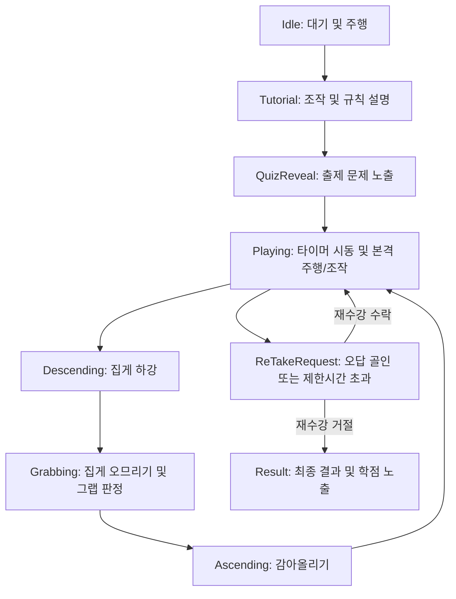

# [Gamify-KWU] 인형뽑기(ClawMachine) 미니게임 기능 명세서

본 명세서는 `Gamify-KWU` 프로젝트의 인형뽑기(`ClawMachine`) 미니게임에 적용된 아키텍처, 물리 시뮬레이션 및 데이터 흐름 등 기능 전반에 대해 상세히 설명합니다.

---

## 1. 미니게임 개요 및 핵심 루프 (Game Overview & Flow)

인형뽑기 미니게임은 플레이어가 퀴즈의 정답이 담긴 캡슐 인형을 물리 집게로 뽑아 퇴출구에 골인시켜 정답을 맞추는 **물리 기반 교육 미니게임**입니다. 

### 1.1. 게임 상태 전이 (ClawStateType)
게임의 상태는 `ClawGameViewModel`에서 관리하며 아래와 같은 흐름으로 제어됩니다:

1. **Tutorial (튜토리얼)**: 게임 시작 전 조작 및 규칙 설명 팝업을 노출합니다.
2. **QuizReveal (퀴즈 노출)**: 출제될 퀴즈의 질문 텍스트를 팝업 패널(`ClawGameQuizUI_View`)에 보여주고 효과음을 재생합니다.
3. **Idle (플레이 대기)**: 카트 주행 및 집게 하강 조작이 가능한 메인 플레이 대기 상태입니다.
4. **Descending / Grabbing / Ascending**: 집게가 하강하여 캡슐을 조이고 다시 끌어올리는 물리 연출 시퀀스 상태입니다.
5. **ReTakeRequest (재수강 요청)**: 제한시간이 초과되거나 오답 캡슐을 빠뜨렸을 때 기회를 다시 부여하기 위해 재수강 팝업을 띄우는 상태입니다.
6. **Result (결과 화면)**: 정답을 맞췄을 때 최종 소요 시간과 학점(Grade)을 매겨 게임을 완료하는 상태입니다.

---

## 2. 데이터 및 초기화 구조 (Data & Spawning)

### 2.1. 퀴즈 데이터 매핑
- **QuizDatabaseSO & QuizData**: ScriptableObject 데이터 자산에서 미니게임 유형이 `QuizType.ClawMachine`인 문제를 무작위로 1개 추출하여 `ClawGameViewModel`에 세팅합니다.
- **선택지 셔플**: 퀴즈의 정답 1개와 오답 4개를 무작위 셔플하여 총 5개의 캡슐을 스폰합니다.
- **오브젝트 풀링**: 가비지 컬렉터(GC) 부하 최소화를 위해 캡슐 생성 시 기존 비활성화된 캡슐 풀(`m_dollPool`)을 재사용합니다.

### 2.2. 물리 배치 (Collision Free Spawn)
- `BoxCollider2D`로 지정된 스폰 영역 내에서 이미 생성된 다른 캡슐들과 최소 거리(`SPAWN_MIN_DISTANCE = 0.6f`)를 유지하며 겹치지 않게 무작위 좌표에 캡슐을 안착시킵니다.
- 5개의 캡슐은 각각 HSL 시각적 컬러링(파랑, 빨강, 초록, 노랑, 보라)이 적용됩니다.

---

## 3. 조작 시스템 (Controls)

플레이어는 UI 버튼 입력(모바일 환경 대응) 또는 키보드 단축키(PC 환경 대응)로 집게 카트를 직접 조작합니다. 일시정지 중에는 모든 조작 입력이 차단됩니다.

| 입력 액션 | UI 버튼 | PC 단축키 | 상세 기능 |
|:---|:---|:---|:---|
| **좌측 이동** | `Left_Button` (PointerDown/Up) | `A` 또는 `←` 누름/뗌 | 집게 카트가 좌측 한계선(`m_minCartX = -4.0`)까지 주행합니다. |
| **우측 이동** | `Right_Button` (PointerDown/Up) | `D` 또는 `→` 누름/뗌 | 집게 카트가 우측 한계선(`m_maxCartX = 4.0`)까지 주행합니다. |
| **집게 하강 (Catch)** | `Descend_Button` | `Spacebar` (1회 입력) | 주행을 멈추고 집게발을 벌린 상태로 하강을 개시합니다. |
| **강제 릴리즈 (Drop)** | `Release_Button` | `Spacebar` (집게 닫힌 상태) | 집게에 캡슐이 들려 있거나 집게발이 닫혀 있을 때 즉시 집게를 펴고 캡슐을 떨어뜨립니다. |

---

## 4. 물리 및 와이어 시각화 시뮬레이션 (Physics & Visuals)

### 4.1. 카트 및 진자 물리 (Pendulum Physics)
- **가속도 관성**: 카트 주행 시 매 프레임 위치 격차를 계산하여 카트 이동에 비례해 집게가 진자 흔들림을 겪도록 각속도 관성(`m_swingSensitivity`)을 부여합니다.
- **중력 복원**: 흔들린 집게는 `m_swingGravity(9.8)` 및 Damping을 통해 점진적으로 0도로 부드럽게 수렴 수렴 복원됩니다.

### 4.2. 중력 낙하 및 기우뚱 올라타기 (Zero Forced Downward Velocity)
- **순수 중력 낙하**: 집게 하강(`Descending`) 시, 캡슐들을 짓이기거나 튕기지 않도록 하방으로의 강제 추종 속도를 완전히 0으로 차단합니다.
- **올라타기**: Y축은 자체 리지드바디 중력(`gravityScale = 2.2f`)에 의한 자연 낙하만 허용하며, 캡슐 위에 얹혔을 때 묵직하게 기우뚱 올라타는 사실감을 연출합니다.
- **조기 하강 완료**: 하강 도중 집게의 양쪽 발 콜라이더에 모두 외부 충돌(바닥이나 캡슐 더미)이 감지되면 하강을 즉시 조기 종료하고 집기 단계로 전이합니다.

### 4.3. 상승 시 수직 복원 토크 및 밧줄 Slack
- **수직 정렬 토크**: 상승(`Ascending`) 시, 기우뚱하게 올라가지 않고 회전 각도에 비례해 부드럽게 0도로 수렴하는 복원 토크(`angularVelocity = -currentAngle * 6.0f`)를 가동합니다. 단, 집기(`Grabbing`) 도중에는 튕김을 막기 위해 복원력을 차단합니다.
- **Rope Slack Effect**: 밧줄이 캡슐 틈새에 끼어 늘어지는 긴장감을 살리기 위해 줄의 실제 물리적 거리 한도에 마진(`maxSlack = 0.35f`)을 두어 Clamping 제한합니다.

### 4.4. 절차적 다관절 스프라이트 와이어 (Lag-Chain Renderer)
- 단순 LineRenderer 대신, 가속도에 지연 반응하며 활처럼 휘어지는 **절차적 다관절 스프라이트 마디(SpriteRenderer) 체인**을 구현했습니다.
- 마디들이 서로 어긋나지 않도록 `N+1`개의 정점을 할당하며, 최상단 정점은 카트에, 최하단 정점은 집게바디 홀더에 100% 밀착시킵니다.

---

## 5. 그랩 필터링 및 튕김 방지 (Grab Filtering & Physics Safety)

### 5.1. 엄격한 양쪽 집게발 충돌 검사
- 왼쪽 집게발(`m_leftColliders`)과 오른쪽 집게발(`m_rightColliders`)의 Overlap 검출 교집합에 포함되어 양쪽 발이 모두 접촉한 동일한 캡슐에 한해서만 그랩 자격을 부여합니다.

### 5.2. 로컬 공간 기하학 검증
후보군에 든 캡슐이 집게 중심 품 안 영역에 잘 들어왔는지 다음과 같이 2차 스크리닝을 수행합니다:
- **거리 상한**: 집게 그랩 원점과의 거리가 `1.2f` 이내일 것.
- **로컬 X축 범위**: 중심 편차가 양쪽 접촉 시 `0.8f` 이내, 한쪽 접촉 시 더욱 좁은 `0.5f` 이내일 것.
- **로컬 Y축 범위**: 집게 하단 `m_localYMin(-0.7f)`과 상단 `m_localYMax(0.4f)` 사이에 존재할 것 (헤드 위로 넘어가거나 처진 경우 방지).

### 5.3. 튕김 및 순간이동(Snap) 원천 차단
- **즉시 그랩 처리**: 적격 캡슐 포착 시, 오므리는 물리 연출 도중이라도 즉시 자식으로 페어런팅하고 해당 캡슐의 물리 연산을 끕니다. 동시에 집게 콜라이더를 꺼서 주변 캡슐들과의 반발력 튕김을 차단합니다.
- **상승 튕김 제어**: 상승 도중에는 Dynamic 물리(흔들림)를 100% 보존하다가, 최상단 밀착 지점에 도달했을 때 비로소 `Kinematic`으로 전환하여 좌우 이동 복귀 시 흔들림을 막습니다.

---

## 6. 채점 및 재수강 시스템 (Scoring & Re-take)

### 6.1. 시간 기반 최종 학점(Grade) 평가
플레이어가 캡슐을 퇴출구(`Exit`)에 빠뜨리면 물리 센서가 감지하여 채점을 진행합니다. 정답인 경우, 재수강을 포함해 누적된 총 플레이 시간에 따라 최종 학점을 판별하고 결과를 저장합니다.

| 소요 시간 | 획득 학점 (MinigameGrade) |
|:---|:---|
| **60초 이하** | **A** |
| **80초 이하** | **B** |
| **100초 이하** | **C** |
| **120초 이하** | **D** |
| **120초 초과** | **F** |

### 6.2. 재수강(Re-take) 피드백 루프
- **오답 제출 or 120초 초과**: 게임이 오버되지 않고, **재수강 요청 상태**로 진입합니다.
- **재수강 수락 시**:
  - 재수강 카운트(`ReTakeCount`)가 1 증가합니다.
  - 플레이어에게 다시 5회의 하강 도전 기회를 제공합니다.
  - 다음 플레이를 위한 제한시간을 다시 충전해 줍니다.
  - 기존 캡슐의 물리 상태와 집게 카트의 물리 위치를 원점(`m_initialPosition`)으로 부드럽게 초기화합니다.
- **재수강 거부 시**: F학점(혹은 중간 성적)으로 결과 화면으로 전이되어 미니게임을 퇴장합니다.

---

## 7. 업데이트 및 작업 이력 (Revision History)

| 버전 | 날짜 | 작성자 | 변경 사항 요약 |
|:---|:---|:---|:---|
| **v1.0** | 2026-06-12 | 윤승종 | 인형뽑기 미니게임 기초 기능 명세 및 물리 시뮬레이션 문서화 완료. |
| **v1.1** | 2026-06-21 | 윤승종 | - **퀴즈 데이터 및 카테고리 확장**: `QuizCategory` enum 설계 및 힌트 필드 데이터 연동. - **데이터베이스 최종 셋업**: `QuizDatabase.asset`에 ClawMachine용 5종 및 Classic 4지선다용 5종 퀴즈 데이터를 통합하여 총 10개의 직렬화 데이터 세팅 완료. - **비주얼 시안 정밀 재현**: 질문 설명 리스트 앞에 `◆` 지시자 및 점선 구분선 자동 삽입 알고리즘 구현. - ** HintText 신설 및 씬 마이그레이션**: `quizPopupPanel` 하위 `Hint` 이미지의 자식으로 `HintText` (TextMeshProUGUI)를 동적 생성 및 오프셋 배치하여 힌트 상자 레이아웃 정합성 100% 매칭 완료. |

